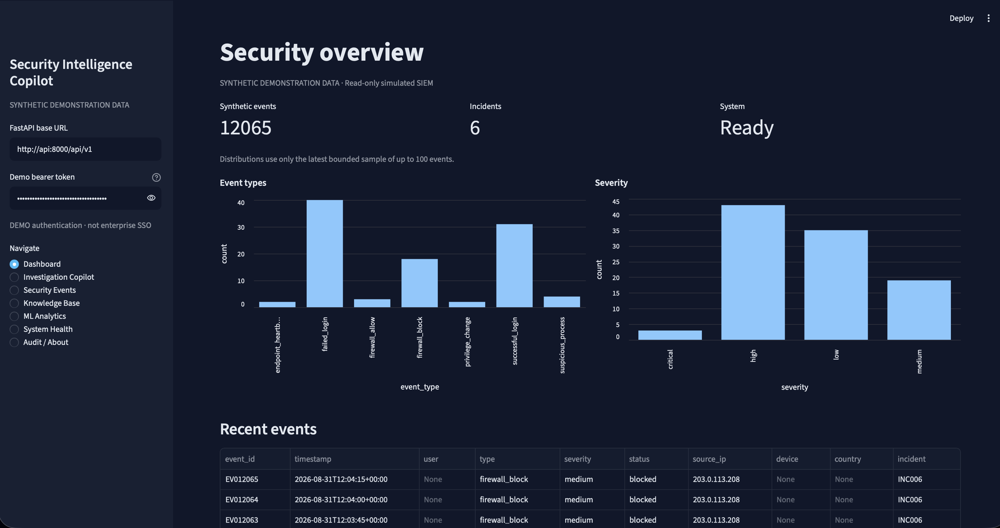
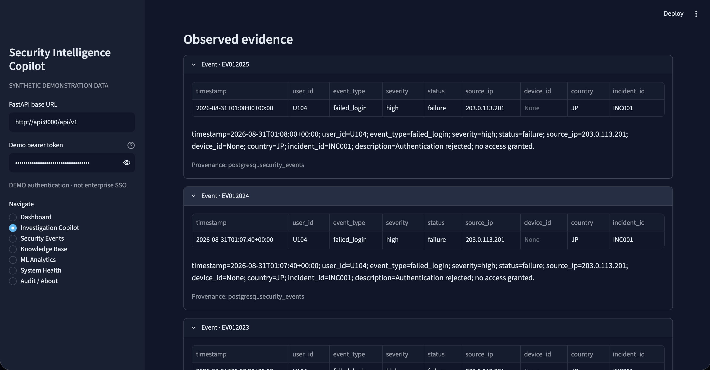
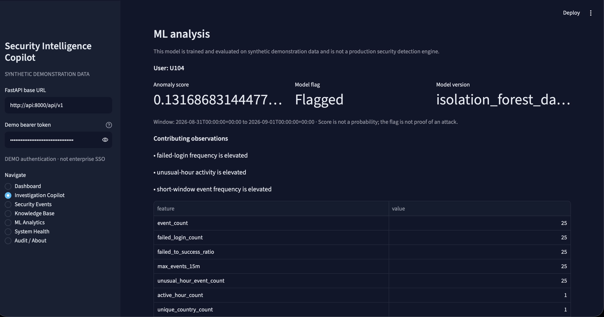
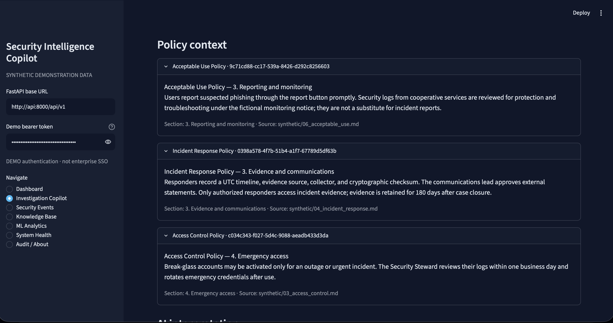
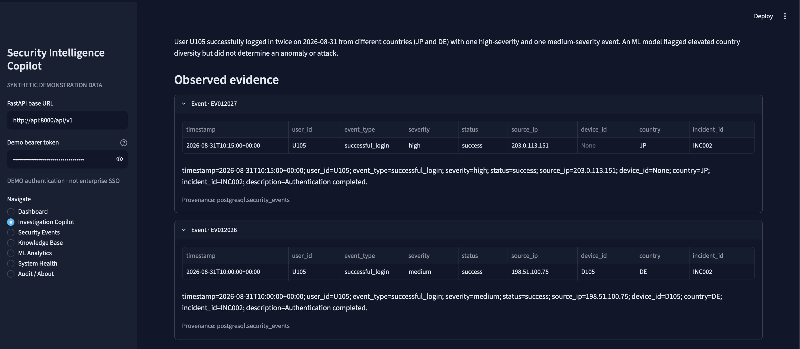
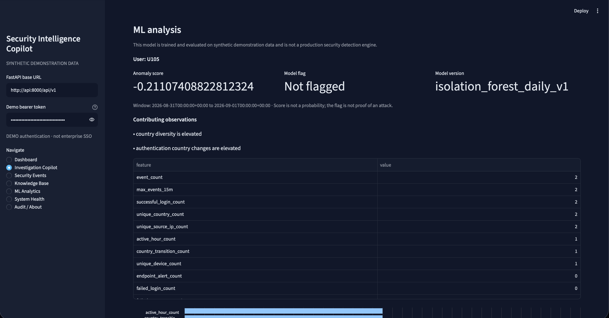
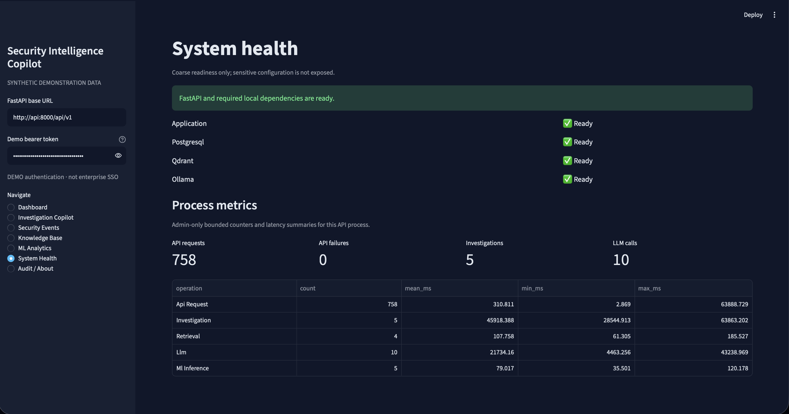
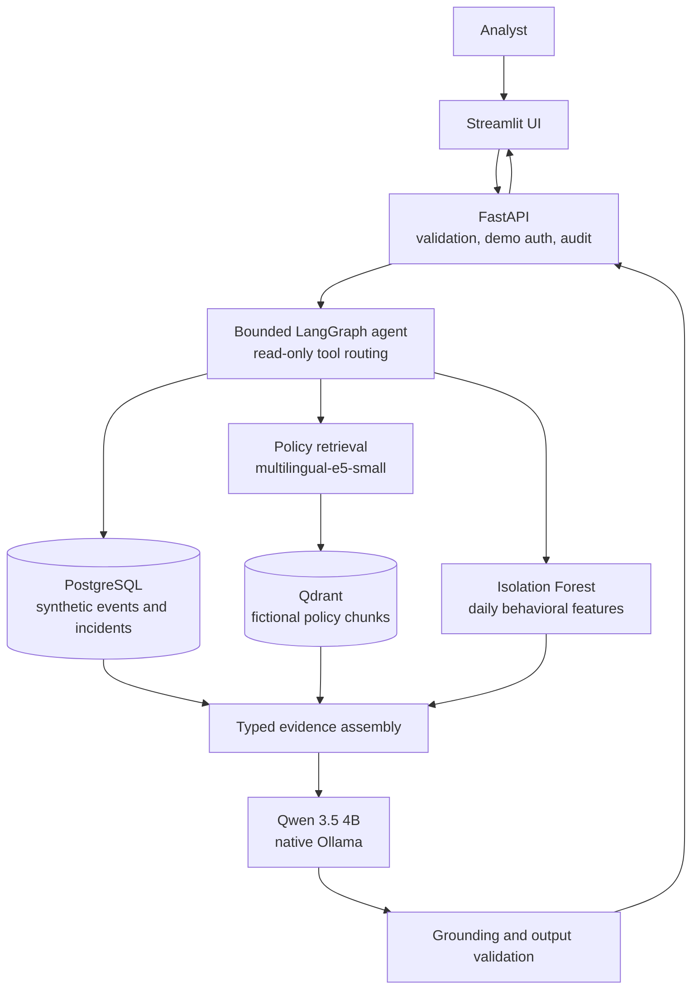

# Enterprise Security Intelligence Copilot

[](https://github.com/haseeb285/enterprise-security-intelligence-copilot/actions/workflows/ci.yml)

A local portfolio project that combines retrieval-augmented generation, a bounded LangGraph agent, and anomaly detection to investigate synthetic security activity. It retrieves fictional policy evidence, queries a simulated SIEM, runs a persisted Isolation Forest, and asks a local Qwen model to explain the assembled evidence without presenting generated interpretation as observed fact.

The complete demonstration runs locally with open-source components. It uses synthetic telemetry and fictional policies and does not claim production SOC effectiveness.

## What It Does

An analyst can ask a policy question, inspect a synthetic event, or submit a multi-source investigation such as:

> Investigate suspicious activity for U104 on 2026-08-31 and determine whether relevant password policy controls apply.

The application validates the request, selects only justified read-only tools, retrieves event and policy evidence, optionally runs anomaly analysis, and returns clearly separated sections:

- observed PostgreSQL records;
- typed ML output, including the exact score and flag;
- fictional policy excerpts with Qdrant citation metadata;
- local-LLM interpretation and bounded next steps;
- application-owned sources, tool outcomes, and evidence sufficiency.

Unknown identifiers, weak retrieval, missing dependencies, and ambiguous requests produce explicit partial or insufficient-evidence outcomes.

## Demo / Screenshots

The Streamlit application includes Dashboard, Investigation Copilot, Security Events, Knowledge Base, ML Analytics, System Health, and Audit/About views.

### Application Dashboard



*The live dashboard presents 12,065 deterministic synthetic events, six incidents, system readiness, and bounded event distributions through FastAPI.*

### Multi-Source AI Investigation

Multi-source investigation combining structured security-event evidence, Isolation Forest analysis, retrieved policy evidence, and grounded LLM synthesis.

| Structured PostgreSQL evidence | Typed Isolation Forest analysis |
| --- | --- |
| [](docs/images/investigation-u104-events.png) | [](docs/images/investigation-u104-ml.png) |

[](docs/images/investigation-u104-policy.png)

*The retrieved policy context is shown as returned by the authentic local run, including its relevance limitations.*

### Evidence vs ML: Known Failure Case

| Observed U105 login evidence | Application-owned ML result |
| --- | --- |
| [](docs/images/investigation-u105-evidence.png) | [](docs/images/investigation-u105-ml.png) |

*Successful logins occur from Germany and Japan 15 minutes apart, while the daily Isolation Forest returns `flagged = false`. The application preserves the model result alongside the contradictory event sequence.*

### System Health



*The live health view reports FastAPI, PostgreSQL, Qdrant, and native Ollama readiness with bounded admin metrics.*

See the [3–5 minute demo guide and screenshot checklist](docs/demo.md).

## Architecture



Streamlit communicates only with FastAPI. Docker Compose runs Streamlit, FastAPI, PostgreSQL, and Qdrant; FastAPI reaches native macOS Ollama through `host.docker.internal`. The recorded Phase 4 smoke run required CPU fallback after a Metal allocation failure, so this project does not claim measured Metal performance.

## AI / ML Engineering

- **RAG:** PDF, Markdown, and text ingestion validates extraction, chunks documents, creates normalized `multilingual-e5-small` embeddings, and stores citation metadata in Qdrant. A fixed `0.805` relevance gate can return insufficient evidence.
- **Local structured generation:** an Ollama provider abstraction calls configurable `qwen3.5:4b` with Pydantic schemas, bounded context/output, explicit timeouts, and safe dependency errors.
- **Agent orchestration:** a five-node LangGraph chooses from six read-only tools. Application code derives identifiers and time filters from the request, caps execution at five graph steps and three tool calls, and rebuilds sources from returned evidence.
- **Anomaly detection:** a persisted Isolation Forest scores 20 leakage-checked daily behavioral features. Training uses a chronological split; MLflow records local experiment parameters, metrics, and artifacts.
- **Grounding:** observed records, ML analysis, policy context, interpretation, and recommendations remain separate. Generated identifiers, anomaly scores, anomaly flags, and write actions are validated or filtered.
- **Evaluation:** versioned cases measure retrieval, structured generation, tool routing, provenance, deterministic facts, safety/failure behavior, anomaly detection, and latency without a paid model judge.

## Key Engineering Features

| Area | Why it exists |
| --- | --- |
| FastAPI + Pydantic | Versioned, validated API contracts with OpenAPI, safe errors, request bounds, demo roles, and dependency injection. |
| PostgreSQL + SQLAlchemy + Alembic | Relational synthetic event/incident storage, parameterized bounded reads, audit records, and reproducible migrations. |
| Qdrant | Local vector search with persistent policy chunk and citation metadata. |
| Streamlit | A thin HTTP client that displays evidence categories without direct database or model access. |
| Docker Compose | Reproducible local services, explicit bootstrap jobs, persistent volumes, and hardened application containers. |
| MLflow | Local comparison and traceability for the two Isolation Forest training configurations. |
| Structured logging | Correlated request, tool, retrieval, LLM, and inference timing with content-safe field allowlists. |
| pytest + GitHub Actions | Deterministic API, RAG, ML, agent, frontend, integration, failure, and build checks with mocked Ollama in CI. |

## Evaluation Results

> **DEVELOPMENT EVALUATION ON SYNTHETIC DATA**
>
> These results describe a small local development suite. They do not estimate production SOC performance.

| Layer | Measured result |
| --- | --- |
| Retrieval ranking | Recall@1 / @3 / @5 = **100% / 100% / 100%**; MRR = **1.000** |
| Retrieval gate | Answerable acceptance = **34/39 (87.18%)**; unanswerable rejection = **8/8 (100%)** |
| ML scenarios | Detected **5/6 (83.33%)**; false-positive rate **40/583 (6.86%)**; flagged precision **11.11%** |
| ML ranking | Top-5 capture **2/6**; Top-10 capture **4/6** |
| Integrated agent | Expected tool selection, provenance, policy citations, and anomaly score/flag fidelity: **20/20 each** |
| Grounding | Unsupported identifier references: **0**; unsupported score references: **0** |
| Local latency | Integrated median **29.563 s**; mean **26.620 s** |

The suite contains 47 retrieval questions, 20 live integrated cases, 13 deterministic safety/failure contracts, and six predeclared fact checks. See the [evaluation methodology](docs/evaluation.md) and [generated results](evaluation/results/phase10-summary.md).

## Interesting Failure Case: U105 Impossible Travel

Synthetic event evidence records successful logins for U105 from Germany and Japan 15 minutes apart. The daily Isolation Forest returned:

```text
score   = -0.21107408822812324
flagged = false
```

The model uses daily aggregate behavior. Although it includes country diversity and transition features, it does not explicitly calculate geographic travel velocity, so this sequence ranked 325th and was missed.

The application preserves both facts: the event evidence shows the cross-country sequence, while the typed ML result remains `false`. The LLM is not allowed to rewrite the score or flag. This makes the limitation visible and demonstrates evidence separation rather than hiding a model failure.

## Running Locally

### Prerequisites

- Apple silicon macOS and Docker Desktop with Compose v2, matching the validated environment;
- native [Ollama](https://ollama.com/) with `qwen3.5:4b` installed;
- Python 3.11 for local tests and utilities;
- two distinct local demo tokens of at least 24 characters.

### Quick start

```bash
ollama pull qwen3.5:4b
cp .env.example .env
# Edit .env: set PostgreSQL values and distinct DEMO_API_TOKEN / DEMO_READ_TOKEN.

make docker-build
make docker-infra
make docker-migrate
make docker-seed
make docker-ingest
make docker-train
make docker-up
```

Open <http://127.0.0.1:8501> and enter a configured demo token. The first bootstrap downloads the embedding model, seeds 12,065 deterministic synthetic events, ingests seven fictional policy files, and trains the local anomaly artifact. Later `make docker-up` runs do not repeat bootstrap work.

See [local deployment](docs/deployment-local.md) for configuration, health checks, cleanup, native development, measured memory, and failure behavior.

## Testing

```bash
.venv/bin/python -m pytest
.venv/bin/ruff check .
.venv/bin/ruff format --check .
```

The Phase 14 checkpoint passed **154 tests**, with **1 live Ollama test intentionally opt-in and skipped**. PostgreSQL and Qdrant integration tests passed. GitHub Actions runs Ruff, ordinary tests with ephemeral PostgreSQL and mocked Ollama behavior, Alembic and Compose checks, and build-only application images. The first hosted three-job CI run passed on GitHub Actions.

## Project Structure

```text
app/
  api/          FastAPI routes, schemas, and services
  agent/        LangGraph state, routing, tools, and evaluation
  rag/          document ingestion, embeddings, Qdrant, retrieval
  ml/           features, Isolation Forest, inference, MLflow tracking
  llm/          provider contract and Ollama adapter
  evaluation/   layered scoring and safety contracts
frontend/       Streamlit HTTP client and presentation helpers
data/policies/  public fictional policy corpus
evaluation/     versioned cases and sanitized measured results
tests/          unit, integration, API, agent, ML, RAG, and UI tests
docs/           architecture, operations, security, evaluation, and demo guides
```

## Limitations

- All security events and policies are synthetic or fictional.
- Bearer tokens demonstrate authentication and two roles; they are not enterprise SSO.
- The local 4B Qwen model is resource-aware but slow, with roughly 30-second median integrated latency.
- The fixed retrieval gate rejects 5 of 39 answerable development questions.
- The Isolation Forest produces false positives and misses the U105 impossible-travel sequence.
- One evaluated password-policy response retrieved the correct evidence but generated generic prose.
- The deployment is a loopback Docker Compose demonstration without production identity, TLS, managed secrets, high availability, or cloud infrastructure.

## Skills Demonstrated

- **AI / GenAI:** RAG, local embeddings, vector search, local LLM inference, structured generation, LangGraph tool routing, grounding, provenance, and layered evaluation.
- **Machine Learning:** leakage-aware feature engineering, chronological validation, Isolation Forest anomaly detection, model persistence, MLflow experiment tracking, latency and failure analysis.
- **Backend / Data:** FastAPI, Pydantic, PostgreSQL, SQLAlchemy, Alembic, Qdrant, bounded REST APIs, authentication roles, and audit data.
- **Engineering:** Docker, Docker Compose, pytest, GitHub Actions, structured logging, health checks, configuration management, security boundaries, and reproducible local workflows.

## Documentation

- [3–5 minute demo guide](docs/demo.md)
- [Architecture and environment decisions](docs/phase-0-architecture.md)
- [API contract](docs/api.md) and [agent design](docs/agent.md)
- [RAG](docs/rag.md), [ML](docs/ml.md), and [evaluation](docs/evaluation.md)
- [Security boundary](docs/security.md), [observability](docs/observability.md), and [local deployment](docs/deployment-local.md)
- [Implementation checklist](docs/implementation-checklist.md)
