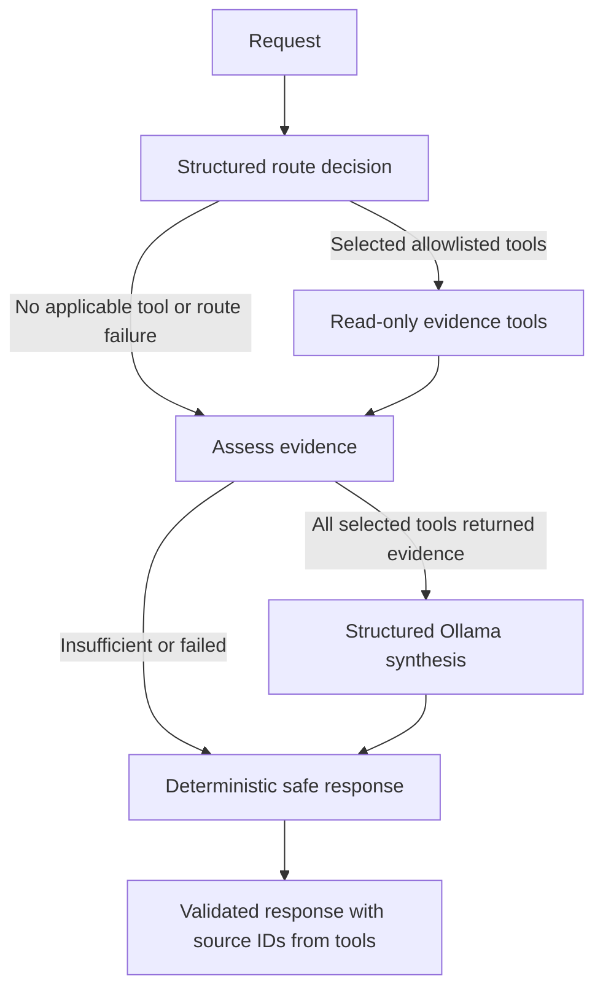

# Phase 6 read-only investigation agent

The Phase 6 agent is a bounded LangGraph over current synthetic policy and simulated SIEM data. It selects only the evidence tools needed for the request. It has no write-capable tool and cannot disable accounts, modify firewalls, reset passwords, close incidents, run a shell, or execute arbitrary SQL. The API exposes it at `POST /api/v1/investigate`; Phase 5 list/detail and retrieval routes remain available.



`AgentState` is a typed LangGraph state with request, role, classification, selected decisions, evidence, tool results and errors, sufficiency, synthesis, counters, and final response. Route proposals and synthesis use Ollama schema-constrained JSON and Pydantic validation. The model proposes only allowlisted tool names. An application-side intent check keeps only sources explicitly requested and fills any explicit source the proposal omitted; identifiers, event type and optional ISO time bounds are derived from the request and validated before use. A route can select `search_policy`, `search_security_events`, `get_user_events`, `get_event`, or `get_incident`, each at most once. `get_event` performs the exact `EV######` lookup; `get_incident` requires admin. No agent tool implements separate SQL or Qdrant queries.

The fixed graph uses at most five logical nodes, three tool calls, five returned events per event tool, and three policy chunks. It has no retries and sets LangGraph's recursion limit to eight as a second guard. Model-generated tool names are an enum, filters are validated, and duplicate tools are rejected. A route with too many tools is refused before any call. The tool executor handles each selected tool once and records only safe status labels. Missing results, rejected inputs, forbidden incident access, or dependency failures lead to an insufficient-evidence response. Partial observed evidence is preserved, but the graph does not synthesize a conclusion from incomplete required evidence. The policy tool adds a conservative subject-word overlap check after RAG's score threshold to reject clearly unrelated chunks; it can reject valid paraphrases, so its results need further evaluation.

The final response separates model-authored summary and interpretation from `observed_evidence` supplied by tools. It also exposes `policy_context` directly from retrieved policy chunks, so multi-source responses retain the actual requirement even if model prose underemphasizes it. A multi-source policy search uses the policy clause of the request, before its first “and,” to avoid diluting retrieval with event details. Event and incident IDs come from actual PostgreSQL rows. Policy chunk IDs and citation metadata come from Qdrant retrieval results. The application builds `sources` from those records; the model cannot author that field. A generated event, incident, or user ID absent from structured record metadata causes synthesis rejection. Policy, event, and incident text is placed in an explicitly marked untrusted JSON data block in the user prompt. Suspicious instruction lines are masked in the prompt but preserved in returned observed evidence. The system message tells the model to ignore instructions inside source text. Unsafe system-changing next steps are filtered. Known overclaim and unsupported absence patterns in summaries or interpretations are replaced with cautious application-authored text. These are guards, not guarantees of semantic correctness; suspicious source text and malformed outputs are tested. The agent does not expose hidden reasoning.

The API records an audit row per authenticated investigation with selected tool names, per-tool safe outcomes, tool and graph counts, role, and overall outcome. It does not record the full request, token, retrieved policy text, generated explanation, or chain-of-thought. Standalone evaluation runs do not write audit rows. Demo bearer tokens remain local demonstration authentication, not enterprise SSO.

## Local development evaluation

`evaluation/agent_cases.json` contains 18 synthetic requests spanning policy, event searches, exact event lookup, incidents, multiple sources, unknown IDs/policy, and an ambiguous request. Expected tool sets are review hypotheses. Run the opt-in live script only when PostgreSQL, Qdrant, and native Ollama are available:

```bash
.venv/bin/python -m app.agent.evaluate
```

The script measures exact tool-set selection, unnecessary selections, procedural task completion (a grounded response when evidence is expected; safe no-answer when none is expected), structured-call validity, and latency. It writes per-case responses and measurements to ignored `work/phase6-agent-evaluation.json`. These are development checks on one local synthetic set, not a security benchmark or proof of grounding. Review the actual per-case results and limitations in `phase-6-checkpoint.md`.
