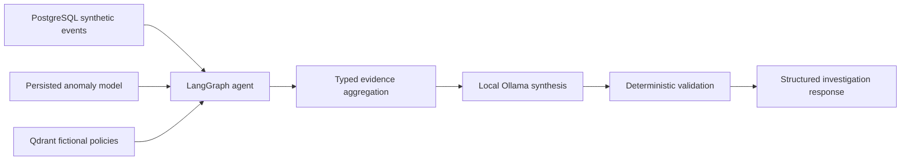

# Integrated read-only investigation agent

The Phase 8 LangGraph combines selected simulated SIEM records, anomaly analysis, and fictional policy retrieval. It remains bounded to five graph nodes, three tool calls, five events per event query, three policy chunks, no retries, and read-only service methods.



## Tools and routing

The allowlist is `search_policy`, `search_security_events`, `get_user_events`, `get_event`, `get_incident`, and `analyze_user_anomaly`. The model proposes names only. Application code derives and validates identifiers, event filters, and time bounds from the request, adds an explicitly required source that the proposal omitted, removes an unjustified proposal, rejects ambiguous identifiers/windows, and enforces the three-call limit.

ML routing requires an explicit anomaly, unusual behavior, ML, or suspicious-activity cue plus one `U###` identifier. A request for an anomaly score selects only ML. An unusual-behavior investigation selects events and ML. A suspicious-activity request that asks about controls selects events, ML, and policy. An ordinary failed-login request remains event only, and a policy question remains policy only.

`analyze_user_anomaly` is a thin adapter over `AnomalyDetectionService`; it does not duplicate event queries, feature engineering, artifact loading, or scoring. Its typed result includes entity, `[start,end)` window, exact score, flag, features, contributing observations, model version, statement, and application provenance. A score is not a probability, and a flag is not proof of attack or compromise.

## Temporal behavior

- Two aware ISO timestamps become an explicit `[start,end)` interval and must be ordered and no longer than the anomaly service's 24-hour bound.
- One aware ISO timestamp means the trailing 24 hours ending at that instant.
- One `YYYY-MM-DD` means that UTC calendar day.
- With no time in an ML request, the service uses that user's latest active UTC calendar day. This deterministic dataset-relative default avoids analyzing future activity.
- When event and ML tools are combined, they receive the same explicit interval. With the default, the event adapter asks the anomaly service for the same latest active day.

Event repository end bounds are exclusive, matching ML feature windows.

## Evidence and response contract

The graph state stores ordinary `EvidenceRecord` objects separately from typed `MLEvidence`. The public response separates:

- `observed_evidence`: PostgreSQL event or incident facts, including structured event attributes;
- `ml_analysis`: exact application-owned model output;
- `policy_context`: retrieved fictional policy text and citation metadata;
- `summary` and `interpretation`: bounded LLM prose;
- `recommended_next_steps`: advisory steps after write-action filtering;
- `evidence_sufficiency`, `sources`, selected tools, safe tool outcomes, errors, and execution counts.

Sources are rebuilt from returned evidence. Generated event, incident, or user IDs absent from provenance cause rejection. An inexact anomaly score in LLM prose is removed; the exact typed ML value remains. Policy citations never come from the model.

The synthesis prompt labels observed facts, ML analysis, and policy context as separate JSON sections. Source text is untrusted data. Obvious injected instruction lines are masked only in the synthesis copy, while the original retrieved evidence remains visible for review. System instructions prohibit invented evidence and warn that ML is analytical evidence. Deterministic output guards filter system-changing recommendations, unsupported absence claims, overclaims, invented IDs, inexact scores, anomaly claims without ML evidence, and policy-violation claims without policy evidence.

## Sufficiency and failures

All selected tools succeeding with at least one evidence object sets `evidence_sufficiency=true`. No evidence returns `insufficient_evidence` without synthesis. If a selected tool fails but another source succeeds, the graph may synthesize `partial_evidence`, keeps sufficiency false, retains the valid evidence, and states why ML was unavailable. Safe ML outcomes distinguish unknown entity, insufficient history, invalid window, dependency failure, and inference failure without exposing paths or exception text.

ML-only output is returned in `ml_analysis`, but the deterministic interpretation says that no security conclusion is supported without observed events. Missing policy prevents a violation claim. Missing ML prevents an anomaly-status claim.

## Known disagreement

For U105 on 2026-08-31, PostgreSQL contains successful logins from Germany and Japan fifteen minutes apart. The model returns exact score `-0.21107408822812324` and `flagged_anomalous=false`. The response preserves both event facts and the negative model flag. This is the documented limitation of daily aggregate features and was not repaired with a hard-coded rule.

## Development evaluation

`evaluation/integrated_agent_cases.json` contains 20 cases covering policy only, event only, ML only, source combinations, unknown and insufficient users, no policy, a missing-model fixture, the impossible-travel disagreement, a retrieved prompt-injection fixture, invalid time, and ambiguity.

Run with healthy PostgreSQL, Qdrant, Ollama, policy collection, and the ignored model artifact:

```bash
.venv/bin/python -m app.agent.evaluate_integrated
```

Use `--case-id ID --merge` to repeat only corrected or interrupted cases while retaining earlier completed records. Results are written to ignored `work/phase8-integrated-evaluation.json`. The measured Phase 8 run selected 20/20 expected tool sets, made zero unnecessary calls, completed 20/20 cases, preserved provenance/citations/scores in 20/20 cases, produced 35 valid structured calls with zero malformed calls, and measured 28.564 seconds mean and 29.157 seconds median latency. These are local synthetic development results, not real detection performance.
