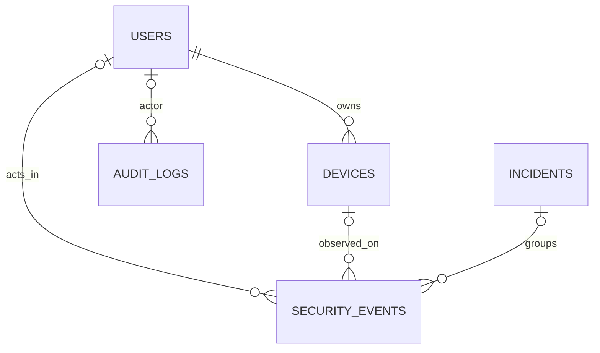

# Phase 2 data model

The operational PostgreSQL schema is created by Alembic revision `20260918_01`. The database is for a single fictional organization, **Clockwork Badger Cooperative**. All records are synthetic demonstration data. The table definitions live in `app/db/models.py`; `migrations/versions/20260918_01_initial_schema.py` is the reproducible schema migration.

| Table | Key and purpose | Notable fields/indexes |
| --- | --- | --- |
| `users` | `user_id` such as `U104` | fictional name, department, home country, privileged flag, UTC creation timestamp |
| `devices` | `device_id`, owner FK to `users` | fictional hostname, type, managed flag |
| `incidents` | `incident_id` such as `INC001` | title, constrained severity, status, UTC creation time, description |
| `security_events` | `event_id` such as `EV012065`; nullable user, device, incident FKs | UTC event time, source/destination documentation IPs, event type, constrained severity, action/status, country, optional authentication details and attempt counts, source, description |
| `audit_logs` | integer `audit_id`, optional actor FK | UTC time, action, resource, result, details; currently records the synthetic seed manifest |

Event indexes cover `(user_id, timestamp)`, timestamp, type, severity, source IP, device, and incident. Repository reads use SQLAlchemy bound parameters, a default page size of 50, and a maximum page size of 100. Invalid IDs, IPs, severity values, naive timestamp filters, or reversed time ranges are rejected. Unknown well-formed IDs return no row.

`DateTime(timezone=True)` stores UTC-aware timestamps in PostgreSQL; the generator creates timestamps with `datetime.UTC`. SQLite tests use `create_all` only for fast isolated repository checks. The live PostgreSQL database is initialized through Alembic and verified with `alembic check`.

Event rows intentionally have no `scenario_id`, `is_anomaly`, or ground-truth reason field. The incident FK is operational grouping and must be excluded from future ML input features, as must incident titles and audit records. Future model training should use observable event and user activity only.
