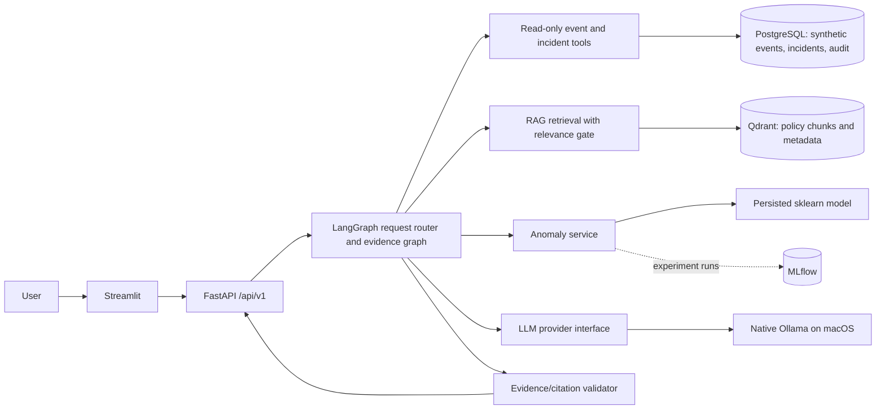

# Phase 0: environment and architecture decision

Status: **planning only**, 2026-09-18. No application code, dependencies, containers, or models were installed or started in this phase.

## Environment observed

| Check | Observation |
| --- | --- |
| Machine | MacBook Air, Apple M3, 8 CPU cores, 16 GB unified memory, arm64 |
| OS | macOS 26.3 (Darwin 25.3.0) |
| Python | `/usr/bin/python3` 3.9.6; `/opt/anaconda3/bin/python3.11` 3.11.7, arm64; no `python3.12` command |
| Git | Apple Git 2.50.1 |
| Docker | CLI 28.3.3 and Compose v2.39.2; Docker Desktop app present, daemon unavailable during inspection |
| Ollama | CLI/app absent; localhost:11434 refused connection |
| Disk | 331 GiB available on the data volume |
| Repository | Project directory initially empty apart from `work/` and `outputs/`; no Git repository |

The hardware is suitable for a local demonstration with modest datasets and one small language model. Python 3.11 is the target, in a project-specific virtual environment, to avoid relying on system Python 3.9 or modifying Anaconda's base environment. Docker must be started and Ollama installed before their integration phases can run. No model pull is part of Phase 0.

## Architecture



FastAPI owns authentication, authorization, request limits, validation, audit records, and the versioned API. A typed LangGraph state carries the user request, selected tools, retrieved evidence, anomaly result, generation result, and errors. A routing node selects only relevant tools; multi-tool investigations can combine event evidence, anomaly inference, and policy retrieval. The LLM is a bounded explainer, not the source of event facts. Output validation accepts citations only from retrieved policy chunks or queried event/incident IDs, labels interpretation separately, and returns an insufficient-evidence response when sources are absent or weak.

Policies enter through an explicit ingestion CLI: PDF/Markdown/TXT extraction, nonempty validation, cleaning, deterministic chunking, metadata and content hash, embedding, Qdrant upsert. PostgreSQL holds structured synthetic events and incident links; Qdrant holds policy vectors and citation payloads. A simulated SIEM tool layer provides filtered, parameterized reads. The anomaly pipeline aggregates user activity features, trains an Isolation Forest on deterministic synthetic data, persists the artifact, logs parameters/metrics/artifacts to MLflow, and exposes scores with a clear synthetic-data caveat. Evaluation uses labeled examples and actual run outputs; no metric is predeclared.

## Technology decisions

- **Python 3.11 + FastAPI, Pydantic, SQLAlchemy, Alembic:** matches installed arm64 interpreter and the requested typed API, SQL storage, and migrations. Pin compatible versions during Phase 1.
- **Native Ollama with `qwen3:4b-instruct` as an initial candidate:** official Ollama listing describes a 4.02B Q4_K_M model, about 2.5 GB on disk, with tool support. It is a starting hypothesis, not a measured performance claim. Keep `OLLAMA_BASE_URL` and `OLLAMA_MODEL` configurable and benchmark small prompts before any upgrade. Prefer deterministic application-side LangGraph routing for evidence selection; model tool calls may assist but must be validated against an allowlist.
- **Embeddings:** a compact, local Sentence Transformers model, loaded once per process; exact model and vector dimension will be selected and verified in Phase 3. Do not run a second large Ollama embedding model by default.
- **Qdrant:** local arm64-capable container, persistent volume, one collection for synthetic policies. Its official installation guide supports AArch64/arm64.
- **PostgreSQL:** one local container and Alembic-managed schema. Use parameterized SQL through SQLAlchemy; no arbitrary query tool for the agent.
- **MLflow:** meaningful experiment tracking with a persistent local SQLite backend and local artifacts is enough for this single-user demonstration. Run its UI as an optional Compose profile so it does not consume memory for ordinary use. MLflow documents SQLite as a supported/default local backend.
- **Docker Compose:** API, frontend, PostgreSQL, Qdrant; optional MLflow. Ollama remains a macOS host process, reached from the API container via `host.docker.internal`. Pin arm64-compatible image versions in implementation; do not rely on `latest` for reproducibility.
- **Security:** environment-based secrets, demo token authentication and basic roles, strict input bounds, audit logs, safe exceptions, and no public network exposure by default. Document OIDC, TLS, real RBAC, secret management, and network controls as future production work.

## Resource and compatibility risks

- A 2.5 GB model file is not its peak runtime memory. Context/KV cache, the embedding model, Python workers, Docker's VM, PostgreSQL, and Qdrant all share 16 GB. Start with one Ollama model, one API worker, a short context window, low concurrency, and a modest Docker memory allocation; measure actual peak use and latency in later phases.
- The current Python 3.11 binary comes from Anaconda. A dedicated venv and lock/pinned constraints avoid base-environment drift. Confirm arm64 wheels for each heavy dependency before installation.
- Docker Desktop is installed but not running, so image architecture, actual Compose startup, and host routing remain unverified. Ollama is absent, so model quality, tool behavior, and Metal performance remain unverified.
- PDF text extraction will not cover scanned image-only PDFs without OCR. Treat those as an explicit failure until OCR is justified.
- Isolation Forest scores on synthetic data cannot establish real detection quality. Evaluate with a separate deterministic synthetic holdout and explain the limits.

## Proposed repository structure

```text
AGENTS.md
README.md
pyproject.toml
.env.example
.gitignore
app/
  api/             # versioned routers and dependencies
  core/            # settings, auth, logging, errors
  db/              # SQLAlchemy models, sessions, migrations
  agents/          # LangGraph state, routing, synthesis
  tools/           # approved evidence queries
  rag/             # extraction, chunking, embedding, retrieval
  llm/             # provider protocol and Ollama adapter
  ml/              # features, training, inference
  schemas/         # request and response contracts
frontend/          # Streamlit client
scripts/           # deterministic seed and ingestion CLIs
data/synthetic/    # public fictional examples only
evaluation/        # cases, runner, measured outputs
tests/             # unit, integration, API and workflow tests
docs/              # architecture, API, RAG, agent, ML, security, deployment
.github/workflows/  # lint, test, image build
```

## Exact Phase 1 proposal

Initialize Git; create the minimal package layout, `pyproject.toml` for Python 3.11, pinned dependency groups, project venv instructions, Pydantic settings, `.env.example`, `.gitignore`, Ruff and pytest configuration, a small import/config smoke test, and README skeleton. Verify the venv/interpreter architecture, install only foundation dependencies, run lint/tests/import checks, inspect the diff and secret exclusions, then record a logical Git checkpoint. Do not start database, RAG, agent, ML, Docker, or frontend implementation in Phase 1.

## Sources consulted for current component claims

- [Ollama Qwen3 4B Instruct model listing](https://ollama.com/library/qwen3%3A4b-instruct)
- [Ollama Apple Silicon acceleration notes](https://ollama.com/blog/mlx)
- [Qdrant installation and supported architectures](https://qdrant.tech/documentation/installation/)
- [MLflow tracking server and SQLite backend](https://mlflow.org/docs/latest/self-hosting/architecture/tracking-server/)
